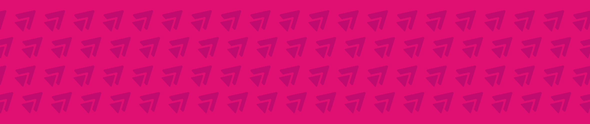

# 🌐 @gigend / https://gigend.github.io/

[](https://beacons.ai/gigend)

Ini adalah repository untuk website personal yang dihosting menggunakan **GitHub Pages**.

Website ini dibangun dengan HTML, CSS, dan JavaScript sederhana — untuk profil online, portfolio, atau landing page jasa.

🔗 **Live Website:**  [https://gigend.github.io/](https://gigend.github.io/)

---

## 💾 Struktur Folder

```
/docs
├── index.html         -> Halaman utama
├── favicon.icon       -> Favicon
├── main.js            -> JavaScript utama
├── styles.css         -> CSS utama
└── assets/
    ├── fonts/         -> Font custom
    └── images/        -> Gambar
└── element/
    ├── footer.html
    ├── navbar.html
└── pages/
    ├── portfolio/ 
        ├── index.html
        ├── styles.css
    ├── support/        
    ├── template/
```

---

## 🚀 Cara Deploy

1. Clone repository ini.
2. Tambahkan atau edit file di dalam folder `docs/`.
3. Push ke branch `main` (GitHub Pages akan otomatis update).

---

## 🎯 Catatan

- Semua halaman tambahan (seperti Support, Price List) disimpan di dalam `docs/pages` agar bisa diakses dari web publik.
- Akan terus di-update, agar lebih rapi dan terstruktur.

## 📝 To-Do List

- [ ] Merapikan Icon / Solid Color Icon
- [ ] Transisi Darkmode
- [ ] Membuat Halaman `pages/support.html`
- [ ] Membuat Halaman `pages/project-portfolio.html`
- [ ] Membuat Halaman `pages/price-list.html`
- [ ] Membuat Animasi Lazyload untuk `images` dan akan muncul setelah terlihat di layar (viewport)

## 👤 Author

Made with ❤️ by [Gigend](https://gigend.github.io/)